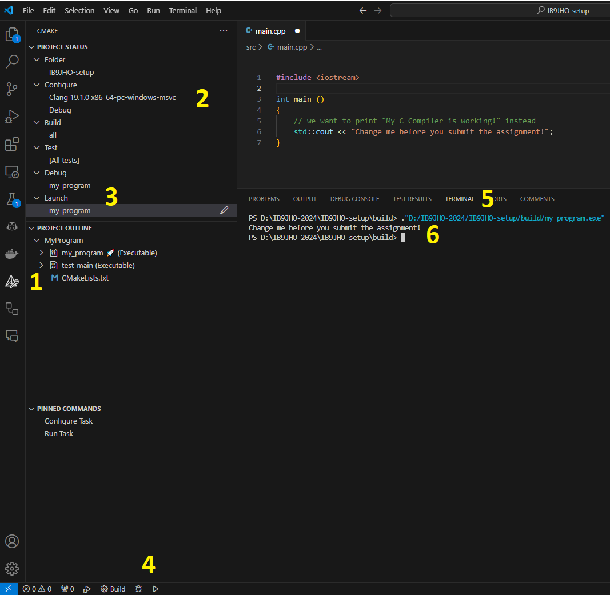
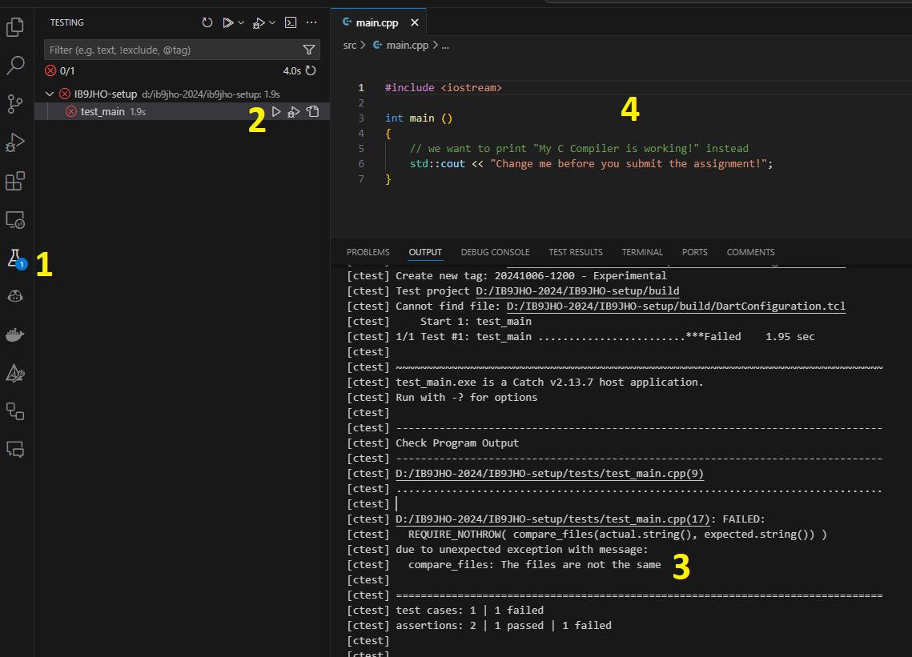

## IB9JHO Enviroment setup
This is a repository for IB9JHO which you can use to set up your programming environment and check it works correctly.

# Setting up the Environment on your device

Follow the instructions in [local environment setup](local-setup.md). Then continue the guide below to 
check that your environment is working correctly.

# Cloud back up Environment

You are recommended to use your device for programming because it is much faster, not limited on computing resources, and available offline. But you can fall back to using a codespace in the cloud if you can't work on your device.

Please note that:
- You should always select the **clang compiler** when prompted while you are working on IB9JHO. This ensures we are all using the same build tools.
- Your work on a codespace will be saved even when you close it down, but they do expire after a period of time. You should
   push your changes to the repository regularly (see the [submission section](#submission)) to avoid losing your work. 
- You should NOT create multiple codespaces to work on the same repository. You should create a single codespace and close/re-open it when needed.

You can use github to create new codespaces and open existing ones in your web browser.
  
*Create and run a codespace through github.*

Or you can open them in vscode (which is installed on your device) if you add the codespaces extension.
  
*Work on a codespace in vscode.* 

# Check your environment works

Test that your environment is working by compiling and running the C++ code in this repository found in src/main.cpp.
Download the repository from github by entering `git clone https://github.com/Aurashk/IB9JHO-setup.git folder\to\clone\to` in the terminal in your device.
Or you can download as a zip and extract it. Then open the folder in vscode.

1. **Open the cmake tab** This will show you the various executable programs you can build from the source files in your project.
2. **Check that the clang kit is selected** We will all use the same build tools in the course to avoid any confusion/compatibility issues.
3. **Check that my_program is selected** as the launch target.
4. **Click the play button** to compile and run the launch target you selected (my_program).
5. **Click the terminal tab** This is where standard output will be displayed.
6. **Check the output** You should see the text match the text in src/main.cpp.

  

# Testing

Assignments are marked automatically using tests which check the output of your code. The tests for this repository are initially failing because the output of our program is not what is expected. The correct output can be found in tests/IO/correct_output.txt.

1. **Open the test tab** This will show you all the tests available for the project.
2. **Click the play button** to run a test
3. **Check the output** The output of the test will be displayed in the output tab. Notice that it says the two files (tests/IO/correct_output.txt and tests/IO/expected_output.txt) are not the same.
4. **Correct the code** Correct the code and rerun the test to see that it passes.

  

# Submission

You can submit an assignment by pushing (updating) to the repository with all your changes.
You should push to the repository regulary to make sure you don't lose any work - but keep in mind that it is not easy to reverse your changes once you have pushed them.
  

Once you have submitted your assignment and all the tests are passing you should notice the red cross will change to a green tick in 
github. Then you can be confident your assignment is complete and your answers were correct.

**Tests are *not* passing**
  

**Tests are passing**
  

